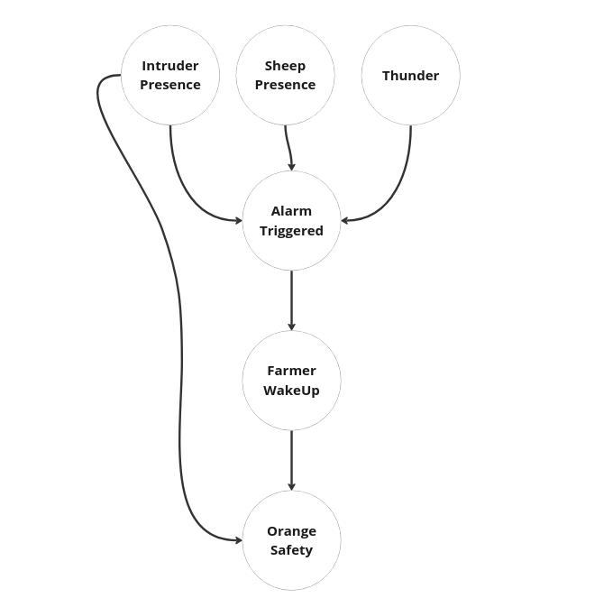
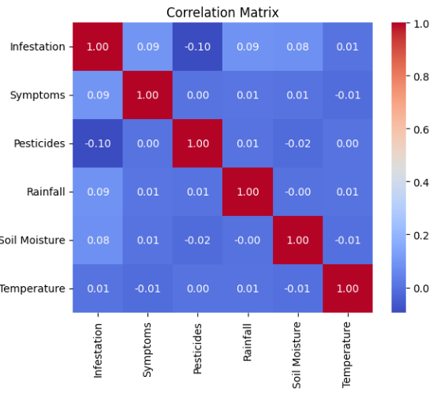
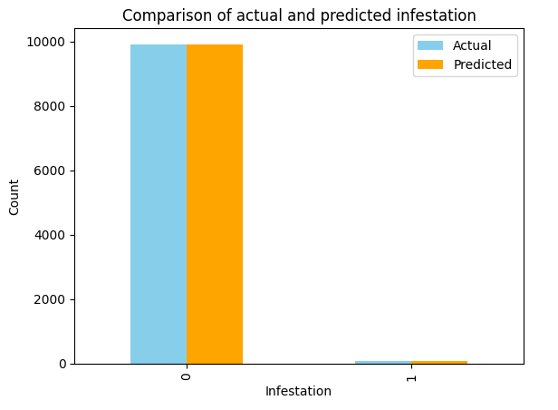

<h1 align="center">📁 Bayesian Classifier 📁</h1>

<div align="center">
	<a href="rep_icon">
	
    </a>
</div>

## Developed by 💻:

- [Fernando Schettini](https://github.com/FernandoSchett).

## About 🤔:

This repository contains a comprehensive Jupyter Notebook with two practical exercises focused on Bayesian networks and Bayesian classifiers. The primary aim of this project is to facilitate learning the fundamental principles of Bayes' Theorem, Bayesian classification, and probability theory based on this theorem.

## Resourses 🧑‍🔬:

- Bayesian Networks Practice: introduces the concept of Bayesian networks, a powerful tool for modeling uncertainty and dependencies among variables. The tutorial uses an orange farm scenario to demonstrate how Bayesian networks can be applied in different scenarios.

- Bayesian Classifier Practice: Through the lens of an orange farm, we explore how to build a simple yet effective Bayesian classifier to predict potential diseases in orange trees based on observable symptoms and environmental conditions.

- Orange farm dataset: A dataset specific to the orange farm, providing the necessary information for conducting the practical exercises.

## Dependencies 🚚:

The project dependencies are described in  ```./dependencies/requirements.``` within the repository. In summary, heres what you're gonna need in order to run the project:

- [```pandas 2.0.2```](https://pandas.pydata.org/).
- [```matplotlib 3.7.1```](https://matplotlib.org/).
- [```seaborn 0.12.2```](https://seaborn.pydata.org/).
- [```ipython 8.6.0```](https://ipython.org/).
- [```jupyter```](https://jupyter.org/).
 
For installing dependencies more quickly, you can run the following command at terminal, inside the clonned repository:

	sudo apt update && sudo apt install python3 python3-pip
    pip3 install -r ./dependencies/requirements.txt

Make sure you have all dependencies before running the project.

## How to run it 🏃:

First, clone this repository. After that, simply execute the ```bayesian_classification,ipynb``` file with the command:

    jupyter notebook bayesian_classification.ipynb

## Results 📈:

<div align="center">
	<a href="rep_icon">
	
    </a>
</div>
<h4 align="center">Figure 1 - Bayesian Network from Protect the Oranges!</h4>

<div align="center">
	<a href="rep_icon">
	
    </a>
</div>
<h4 align="center">Figure 2 - Correlation Matriz from Orange Plague.</h4>

<div align="center">
	<a href="rep_icon">
	
    </a>
</div>
<h4 align="center">Figure 3 - Accuracy from Bayesian Classifier.</h4>

### Tools Used 🛠️:

- [Vscode](https://code.visualstudio.com/).
- [Jupyter Notebook](https://jupyter.org/).

## How to contribute 🫂:

Feel free to create a new branch, fork the project, create a new Issue or make a pull request contact one of us to develop at Bayesian Classifier practices.

## Licence 📜:

[Apache V2](https://choosealicense.com/licenses/apache-2.0/)

### Important links 🔗:

- [Understand Bayes Theorem](https://www.youtube.com/watch?v=HZGCoVF3YvM&ab_channel=3Blue1Brown).
- [Bayesian Network - 1](https://www.youtube.com/watch?v=nvzUE6PnPYc&t=436s&ab_channel=UNIVESP).
- [Bayesian Network - 2](https://www.youtube.com/watch?v=TuGDMj43ehw&t=1104s&ab_channel=BertHuang).
- [Bayesian Network - 3](https://www.youtube.com/watch?v=_kGdEAo7SCc&t=797s&ab_channel=Prof.Elder).
- [Bayesian Network - 4](https://www.youtube.com/watch?v=uVwn6l1Sf8U&ab_channel=Prof.Elder).
- [Bayesian Network - Online Editor](http://bayesjs.github.io/bayesjs-editor/).
- [Bayesian Classifier](https://www.youtube.com/watch?v=iDuBTP74Cag&t=1107s&ab_channel=Ci%C3%AAnciadeDadoseAprendizadodeM%C3%A1quina).